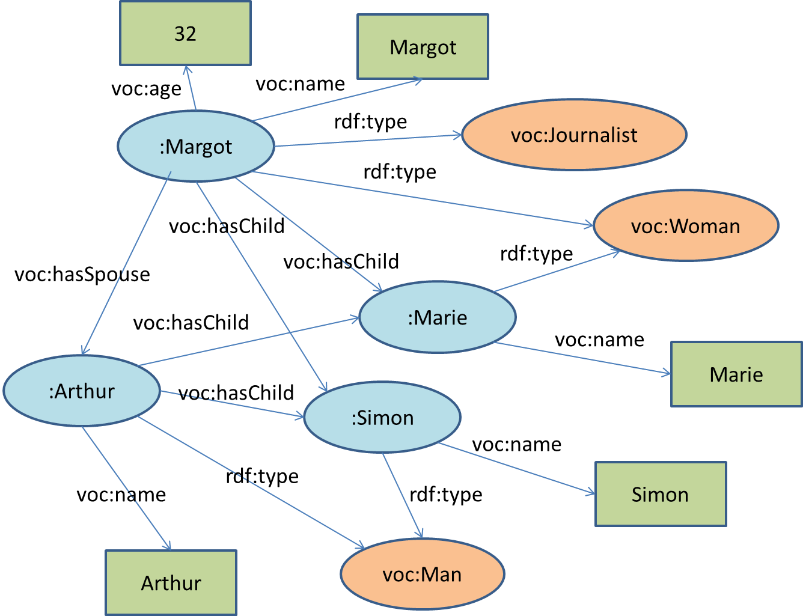

# TP 1 - **RDF** Schemas

### ANTELME Mathis

## 1. Environement de travail

Pour ce TP (et le suivant) nous utiliserons trois outils:
- le [validateur en ligne de syntaxe **RDF**](http://www.w3.org/RDF/Validator/) fourni par le consortium W3. Cet outil ne permet de valider uniquement le format **RDF**/**XML** et offre une visualisation du graphe ;
- l’[outil **RDF** Translator](http://rdf-translator.appspot.com/) permettant de convertir les différentes syntaxes de **RDF** (attention il ne fonctionne qu’avec certains navigateurs : Chrome, Safari, IE).
- l’outil CORESE à la fois comme validateur de fichiers **RDF** (si le chargement réussi cela signifie que le fichier est valide) et comme un interpréteur de requêtes **SPARQL** . Cet outil est développé par l’INRIA de Sophia-Antipolis et il est téléchargeable [ici](http://wimmics.inria.fr/doc/tutorial/corese-3.1.5a.jar). Son lancement s’effectue avec la commande suivante:

`java -jar nomDuFichierCorese.jar`

Son utilisation est simple avec un onglet dédié au chargement de fichier et un autre pour l’interrogation **SPARQL**.

## 2. Une première description **RDF**

Cet exercice est issu du cours en ligne de France Université Numérique sur « Web sémantique et Web de données ». Le but de cet exercice est de construire une petite description **RDF**. Il s’agit de représenter l’énoncé suivant :

*Margot est une femme journaliste, âgée de 32 ans, mariée à Arthur qui est un homme avec qui elle a deux enfants, Marie qui est une femme et Simon qui est un homme. Pour chaque personne on spécifie aussi explicitement le nom.*

### 2.1. Graphe a compléter



### 2.2. Sérialisation du graphe en **RDF**/**XML**

```xml
<?xml version="1.0" encoding="UTF-8"?>
<!DOCTYPE rdf:RDF [
    <!ENTITY vocabulaire "http://www.unice.fr/voc">
    <!ENTITY xsd "http://www.w3.org/2001/XMLSchema#">
]>
<rdf:RDF xmlns:rdf="http://www.w3.org/1999/02/22-rdf-syntax-ns#" xmlns:voc="&vocabulaire;#" xml:base="http://www.unice.fr/data">
    <voc:Woman rdf:about="#Margot">
        <voc:name>Margot</voc:name>
        <voc:age rdf:datatype="http://www.w3.org/2001/XMLSchema#integer">32</voc:age>
        <voc:hasSpouse rdf:resource="#Arthur"></voc:hasSpouse>
        <voc:hasChild rdf:resource="#Simon"></voc:hasChild>
        <voc:hasChild>
            <rdf:Description rdf:about="#Marie">
                <voc:name>Marie</voc:name>
                <rdf:type rdf:resource="&vocabulaire;#Woman"></rdf:type>
            </rdf:Description>
        </voc:hasChild>
        <rdf:type rdf:resource="&vocabulaire;#Journalist"></rdf:type>
    </voc:Woman>
    <voc:Man rdf:about="#Arthur">
        <voc:name>Arthur</voc:name>
        <voc:hasChild rdf:resource="#Simon"></voc:hasChild>
        <voc:hasChild rdf:resource="#Marie"></voc:hasChild>
    </voc:Man>
    <voc:Man rdf:about="#Simon">
        <voc:name>Simon</voc:name>
    </voc:Man>
</rdf:RDF>
```

### 2.3. Sérialisation avec la syntaxe N3 (Turtle)

```xml
@prefix rdf: <http: www.w3.org 1999 02 22-rdf-syntax-ns#> .
@prefix voc: <http: www.unice.fr voc#> .
@prefix xml: <http: www.w3.org XML 1998 namespace> .
@prefix xsd: <http: www.w3.org 2001 XMLSchema#> .
                
<http: www.unice.fr data#Margot> a voc:Journalist, voc:Woman ;
    voc:age "32"^^xsd:string ;
    voc:hasChild    <http: www.unice.fr data#Marie>,
                    <http://www.unice.fr/data#Simon>;
    voc:hasSpouse   <http: www.unice.fr data#Arthur>;
    voc:name "Margot" .
                            
<http: www.unice.fr data#Arthur> a voc:Man ;
    voc:hasChild    <http: www.unice.fr data#Marie>,
                    <http: www.unice.fr data#Simon>;
    voc:name "Arthur" .

<http: www.unice.fr data#Marie> a voc:Woman ;
    voc:name "Marie" .
    
<http://www.unice.fr/data#Simon> a voc:Man ;
    voc:name "Simon" .
```

### 2.4. Utilisation du validateur **RDF** du **W3**

**1. Combien de triplets ont été analysés ?**

Le validateur permet d'analyser 15 triplets.

**2. Combien de nœuds compte le graphe généré ?**

On compte 12 noeuds dans le graphe généré.

## Création de graphes **RDF**

Soit les informations suivantes :
- Le livre ayant l’URL http://www.springerlink.com/content/978-3-540-10235-9/ à pour
auteur Robin Milner
- Le site web de l’université de La Rochelle a pour administrateur Gaëlle Foret qui
possède l’adresse électronique webmestre@univ-lr.fr.

**1.** Écrire le (ou les) triplet(s) **RDF** exprimant l’information contenue dans chaque phrase sans utiliser de nœuds anonymes (ou blancs). En utilisant le support de cours, un guide sur la notation N3 et la spécification **RDF**/**XML** exprimer ces triplets selon ces deux formats. Puis pour tester la correction syntaxique de votre code **RDF**, utiliser:
- le validateur du **W3** pour le format **RDF**/**XML** (qui permet en plus de visualiser le
graphe **RDF**) ;
- CORESE pour le format **RDF**/**N3**.

**2.** Modifier les triplets précédents pour utiliser cette fois-ci au moins un nœud anonyme
(donner les deux formats : **N3** et **RDF**/**XML**) ;