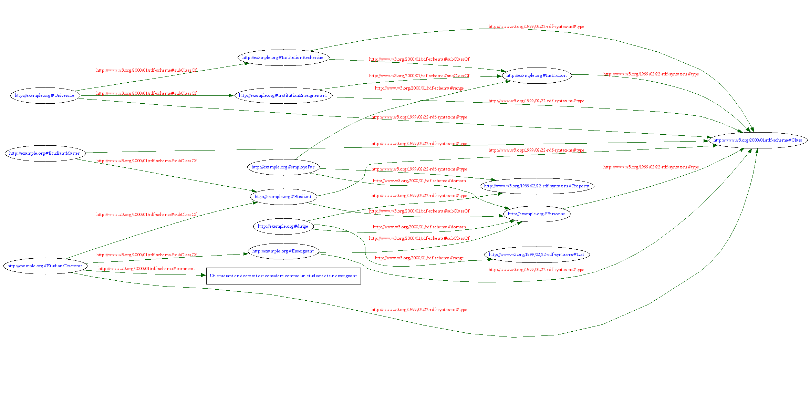

# TP 1 - **RDF** Schemas

### ANTELME Mathis

## 1. Environement de travail

Pour ce TP (et le suivant) nous utiliserons trois outils:
- le [validateur en ligne de syntaxe **RDF**](http://www.w3.org/RDF/Validator/) fourni par le consortium W3. Cet outil ne permet de valider uniquement le format **RDF**/**XML** et offre une visualisation du graphe ;
- l’[outil **RDF** Translator](http://rdf-translator.appspot.com/) permettant de convertir les différentes syntaxes de **RDF** (attention il ne fonctionne qu’avec certains navigateurs : Chrome, Safari, IE).
- l’outil CORESE à la fois comme validateur de fichiers **RDF** (si le chargement réussi cela signifie que le fichier est valide) et comme un interpréteur de requêtes **SPARQL** . Cet outil est développé par l’INRIA de Sophia-Antipolis et il est téléchargeable [ici](http://wimmics.inria.fr/doc/tutorial/corese-3.1.5a.jar). Son lancement s’effectue avec la commande suivante:

`java -jar nomDuFichierCorese.jar`

Son utilisation est simple avec un onglet dédié au chargement de fichier et un autre pour l’interrogation **SPARQL**.

## 2. Une première description **RDF**

Cet exercice est issu du cours en ligne de France Université Numérique sur « Web sémantique et Web de données ». Le but de cet exercice est de construire une petite description **RDF**. Il s’agit de représenter l’énoncé suivant :

*Margot est une femme journaliste, âgée de 32 ans, mariée à Arthur qui est un homme avec qui elle a deux enfants, Marie qui est une femme et Simon qui est un homme. Pour chaque personne on spécifie aussi explicitement le nom.*

### 2.1. Graphe a compléter


### 2.2. Sérialisation du graphe en **RDF**/**XML**

```xml
<?xml version="1.0" encoding="UTF-8"?>
<!DOCTYPE rdf:RDF [
    <!ENTITY vocabulaire "http://www.unice.fr/voc">
    <!ENTITY xsd "http://www.w3.org/2001/XMLSchema#">
]>
<rdf:RDF xmlns:rdf="http://www.w3.org/1999/02/22-rdf-syntax-ns#" xmlns:voc="&vocabulaire;#" xml:base="http://www.unice.fr/data">
    <voc:Woman rdf:about="#Margot">
        <voc:name>Margot</voc:name>
        <voc:age rdf:datatype="http://www.w3.org/2001/XMLSchema#integer">32</voc:age>
        <voc:hasSpouse rdf:resource="#Arthur"></voc:hasSpouse>
        <voc:hasChild rdf:resource="#Simon"></voc:hasChild>
        <voc:hasChild>
            <rdf:Description rdf:about="#Marie">
                <voc:name>Marie</voc:name>
                <rdf:type rdf:resource="&vocabulaire;#Woman"></rdf:type>
            </rdf:Description>
        </voc:hasChild>
        <rdf:type rdf:resource="&vocabulaire;#Journalist"></rdf:type>
    </voc:Woman>
    <voc:Man rdf:about="#Arthur">
        <voc:name>Arthur</voc:name>
        <voc:hasChild rdf:resource="#Simon"></voc:hasChild>
        <voc:hasChild rdf:resource="#Marie"></voc:hasChild>
    </voc:Man>
    <voc:Man rdf:about="#Simon">
        <voc:name>Simon</voc:name>
    </voc:Man>
</rdf:RDF>
```

### 2.3. Sérialisation avec la syntaxe N3 (Turtle)

```xml
@prefix rdf: <http: www.w3.org 1999 02 22-rdf-syntax-ns#> .
@prefix voc: <http: www.unice.fr voc#> .
@prefix xml: <http: www.w3.org XML 1998 namespace> .
@prefix xsd: <http: www.w3.org 2001 XMLSchema#> .
                
<http: www.unice.fr data#Margot> a voc:Journalist, voc:Woman ;
    voc:age "32"^^xsd:string ;
    voc:hasChild    <http: www.unice.fr data#Marie>,
                    <http://www.unice.fr/data#Simon>;
    voc:hasSpouse   <http: www.unice.fr data#Arthur>;
    voc:name "Margot" .
                            
<http: www.unice.fr data#Arthur> a voc:Man ;
    voc:hasChild    <http: www.unice.fr data#Marie>,
                    <http: www.unice.fr data#Simon>;
    voc:name "Arthur" .

<http: www.unice.fr data#Marie> a voc:Woman ;
    voc:name "Marie" .
    
<http://www.unice.fr/data#Simon> a voc:Man ;
    voc:name "Simon" .
```

### 2.4. Utilisation du validateur **RDF** du **W3**

**1. Combien de triplets ont été analysés ?**

Le validateur permet d'analyser 15 triplets.

**2. Combien de nœuds compte le graphe généré ?**

On compte 12 noeuds dans le graphe généré.

## Création de graphes **RDF**

Soit les informations suivantes :
- Le livre ayant l’URL http://www.springerlink.com/content/978-3-540-10235-9/ à pour
auteur Robin Milner
- Le site web de l’université de La Rochelle a pour administrateur Gaëlle Foret qui
possède l’adresse électronique webmestre@univ-lr.fr.

**1.** Écrire le (ou les) triplet(s) **RDF** exprimant l’information contenue dans chaque phrase sans utiliser de nœuds anonymes (ou blancs). En utilisant le support de cours, un guide sur la notation N3 et la spécification **RDF**/**XML** exprimer ces triplets selon ces deux formats. Puis pour tester la correction syntaxique de votre code **RDF**, utiliser:
- le validateur du **W3** pour le format **RDF**/**XML** (qui permet en plus de visualiser le
graphe **RDF**) ;
- CORESE pour le format **RDF**/**N3**.

**Au format RDF/XML:**

```xml
<?xml version="1.0"?>
<rdf:RDF xmlns:ex="http://example.org#" xmlns:rdf="http://www.w3.org/1999/02/22-rdf-syntax-ns#">
    <rdf:Description rdf:about="http://www.springerlink.com/content/978-3-540-10235-9/">
        <ex:auteur>Robin Milner</ex:auteur>
    </rdf:Description>
</rdf:RDF><?xml version="1.0"?>
<rdf:RDF xmlns:ex="http://example.org#" xmlns:rdf="http://www.w3.org/1999/02/22-rdf-syntax-ns#">
    <rdf:Description rdf:about="http://www.univ-larochelle.fr">
        <ex:webmestre rdf:resource="http://www.univ-larochelle.fr/Gaelle_Foret" />
    </rdf:Description>

    <rdf:Description rdf:about="http://www.univ-larochelle.fr/Gaelle_Foret">
        <ex:adresseElectronique>webmestre@univ-lr.fr</ex:adresseElectronique>
    </rdf:Description>

</rdf:RDF>  
```

**Au format RDF/N3:**

```xml
@prefix ex: <http://example.org#> . 

<http://www.springerlink.com/content/978-3-540-10235-9/> ex:auteur "Robin Milner" .

@prefix ex: <http://example.org#> .
# ici on crée un identifiant 'artificiel' pour Gaelle Foret
<http://www.univ-larochelle.fr> ex:webmestre <http://www.univ-larochelle.fr/Gaelle_Foret> .
<http://www.univ-larochelle.fr/Gaelle_Foret>    ex:nom "Gaelle Foret" ;
                                                ex:adresseElectronique "webmestre@univ-lr.fr" . 
```

**2.** Modifier les triplets précédents pour utiliser cette fois-ci au moins un nœud anonyme
(donner les deux formats : **N3** et **RDF**/**XML**);

**Avec le format RDF/N3:**

```xml
@prefix ex: <http://example.org#> . 

<http://www.springerlink.com/content/978-3-540-10235-9/> ex:auteur [ ex:nom "Robin Milner" ] .
@prefix ex: <http://example.org#> .

<http://www.univ-larochelle.fr> ex:webmestre [
   ex:nom "Gaelle Foret"
   ex:adresseElectronique "webmestre@univ-lr.fr" ;
   ] .
```

**Au format RDF/XML:**

```xml
<?xml version="1.0" encoding="UTF-8"?>
<rdf:RDF xmlns:ex="http://example.org#" xmlns:rdf="http://www.w3.org/1999/02/22-rdf-syntax-ns#">
    <rdf:Description rdf:about="http://www.springerlink.com/content/978-3-540-10235-9/">
        <ex:auteur ex:nom="Robin Milner" />
    </rdf:Description>
</rdf:RDF><?xml version="1.0" encoding="UTF-8"?>
<rdf:RDF xmlns:ex="http://example.org#" xmlns:rdf="http://www.w3.org/1999/02/22-rdf-syntax-ns#">
    <rdf:Description rdf:about="http://www.univ-larochelle.fr">
        <ex:webmestre ex:nom="Gaelle Foret" ex:adresseElectronique="webmestre@univ-lr.fr" />
    </rdf:Description>
</rdf:RDF>
```

## 4. Les schémas **RDF**

**1.** Créer un schéma **RDF** (en notation **N3**) à partir des spécifications suivantes :
- utiliser les classes suivantes : Institution, InstitutionRecherche, InstitutionEnseignement, Université, Personne, Etudiant, Enseignant, EtudiantMaster et EtudiantDoctorat ;
- utiliser la propriété de subsomption (`rdfs:subClassOf`) pour relier les classes ;
- définir des propriétés estEmployéPar et dirige (au sens où une personne peut diriger un ensemble de personnes).



**2.** Le schéma **RDF** sauivant:

```
ex:ClasseA rdf:type rdfs:Class
ex:ClasseB rdfs:subClassOf ex:ClasseA
ex:unB rdf:type ex:ClasseB
```

Peut être écrit en **RDF**/**XML** de la manière suivante:

```xml
<?xml version="1.0"?>
<!DOCTYPE rdf:RDF [
    <!ENTITY ex "http://example.org#">
    <!ENTITY rdfs "http://www.w3.org/2000/01/rdf-schema#">
]>
<rdf:RDF xmlns:rdf="http://www.w3.org/1999/02/22-rdf-syntax-ns#" xmlns:rdfs="http://www.w3.org/2000/01/rdf-schema#" xmlns:ex="http://example.org#">

    <rdf:Description rdf:about="&ex;ClasseA">
        <rdf:type rdf:resource="&rdfs;Class" />
    </rdf:Description>

    <rdf:Description rdf:about="&ex;ClasseB">
        <rdf:type rdf:resource="&rdfs;Class" />
        <rdfs:subClassOf rdf:resource="&ex;ClasseA" />
    </rdf:Description>

    <rdf:Description rdf:about="&ex;unB">
        <rdf:type rdf:resource="&ex;ClasseB" />
    </rdf:Description>
</rdf:RDF>
```

Ou si on abrège:

```xml
<?xml version="1.0"?>
<rdf:RDF xmlns:rdf="http://www.w3.org/1999/02/22-rdf-syntax-ns#" xmlns:rdfs="http://www.w3.org/2000/01/rdf-schema#" xmlns:ex="http://example.org#" xml:base="http://example.org">
    <rdfs:Class rdf:ID="ClasseA" />
    <rdfs:Class rdf:ID="ClasseB">
        <rdfs:subClassOf rdf:resource="#ClasseA" />
    </rdfs:Class>
    <ex:ClasseB rdf:ID="unB" />
</rdf:RDF>
```

**Donner la forme RDF/XML du schémas précédent (université) et vérifier sa validité, puis tester les classes définies dans le schéma via la requête SPARQL suivante:**

```SQL
PREFIX ex: <http://example.org#>
SELECT ?x
WHERE {
    ?x rdf:type rdfs:Class .
    FILTER (?x ^ ex: )
}
```

*Note:* La fonction du filtre est de sélectionner uniquement les classes définies dans l’espace de noms http://example.org (l’opérateur ^ vérifie que le nom de la ressource débute par l’espace de noms).